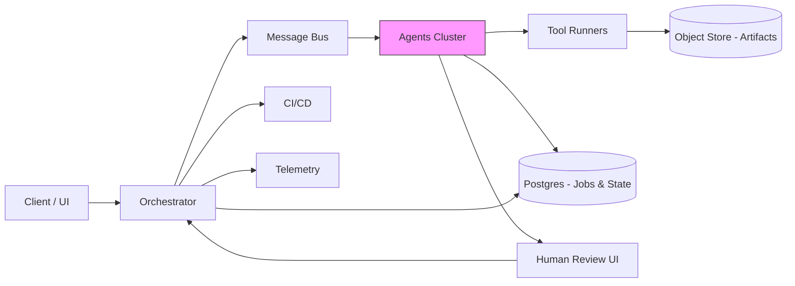
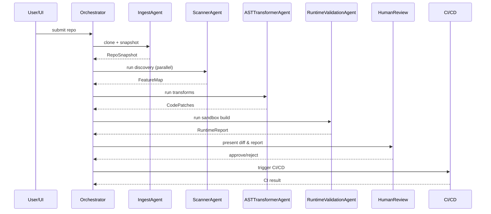
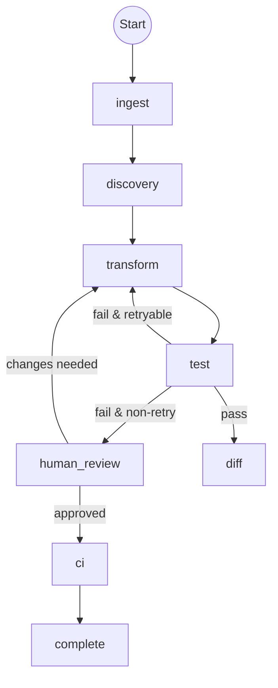

# MigratorAI — ADK + Python: Complete Workflow

**Purpose:** Build an agent-driven system that automatically migrates a **Spring Boot** project into a **Quarkus** application. The system uses multiple cooperating agents, tool integrations, structured outputs, callbacks/sessions/state, and persistent storage for traceability, repeatability and safe rollbacks.

---

## Executive summary

This document describes a production-ready architecture and end-to-end workflow for _MigratorAI_: an ADK + Python based system that ingests a Spring Boot repository and outputs a Quarkus-ready project + migration report. The system is agent-driven and includes analysis, automated transforms, testing, human-in-the-loop review, and CI/CD integration.

Key features:

- Pluggable agents (scanning, AST transformation, dependency mapping, config conversion).
- Structured outputs (JSON schemas) per agent for deterministic pipelines.
- Persistent job & artifact store (Postgres + object store).
- Orchestration & retry via message queues / workflows.
- Human approval gates and rollback support.

---

## High-level architecture (text + diagrams)

### Components

1. **Client/UI** — Web UI (or CLI) to upload repo or point to Git URL; shows progress, diffs and reports.
2. **Orchestrator / Controller** — Central workflow engine that starts jobs and coordinates agents (sequential / parallel / loop patterns).
3. **Agents (ADK)** — Individual micro-agents performing focused tasks (ScannerAgent, TransformAgent, TestAgent, etc.).
4. **Tooling & Runners** — Language tools (OpenRewrite, Quarkus CLI, Maven/Gradle), build runners and test runners executed in sandboxed containers.
5. **Persistence & Artifacts** — Postgres for job metadata & sessions; Object storage (S3 / MinIO) for artifacts, patch bundles, and reports.
6. **Message bus** — RabbitMQ / Redis Streams / Kafka used for agent communication, callbacks and retries.
7. **Human Review UI** — For diffs, accept/reject and comment. Supports manual edits and requeue.
8. **CI/CD integration** — GitHub/GitLab actions or Jenkins pipelines to apply patches, run full CI and deploy preview environments.
9. **Telemetry & Audit** — Logs, metrics, and tracing (Prometheus + Grafana + Jaeger).

### Mermaid component diagram



---

## Agents: list, roles & responsibilities

> Each agent is small, single-responsibility, and emits _structured outputs_ (JSON) into the bus and persistent DB so other agents can consume deterministically.

### 1) IngestAgent

- **Purpose:** fetch repository and create job/session.
- **Inputs:** Git URL or uploaded ZIP, credentials, branch.
- **Actions:** clone repo (via JGit or `git`), validate, compute baseline metrics (lines, modules), store a snapshot in object store, create job record in DB.
- **Outputs:** `RepoSnapshot` JSON (repo_id, commit, modules, build tool)
- **Run mode:** sequential at job start.

### 2) ScannerAgent (Parallelizable)

- **Purpose:** static analysis and discovery.
- **Actions:** identify Spring Boot features (starters, starters versions), auto-configurations, properties files, profiles, scheduler endpoints, data access layers (Jpa, JdbcTemplate), web controllers, WebFlux usage.
- **Tools used:** `grep`, `mvn dependency:tree`, `gradle dependencies`, OpenRewrite detectors, Java parser (OpenRewrite/JavaParser).
- **Outputs:** `FeatureMap` JSON (list of found patterns, risk scores per module).
- **Run mode:** parallel per module.

### 3) DependencyAnalyzerAgent

- **Purpose:** map Maven/Gradle dependencies to Quarkus-equivalents.
- **Actions:** create mapping table using rules (e.g., `spring-boot-starter-web` -> `quarkus-resteasy` or `quarkus-vertx`). Flag incompatible or manual items.
- **Outputs:** `DependencyPlan` JSON (add/remove/replace entries with reasons and confidence).

### 4) ConfigMapperAgent

- **Purpose:** convert Spring `application.properties`/`yaml` to Quarkus `application.properties` and `application.yaml` entries, including placeholder mapping.
- **Actions:** JSON-schema mapping, environment variable mapping, externalized config conversion, secrets handling.
- **Outputs:** `ConfigPatch` (file diffs + migration notes).

### 5) ASTTransformerAgent (Core transformer)

- **Purpose:** perform code transformations on Java sources to shift from Spring idioms to Quarkus idioms.
- **Actions:** use AST-based rewrite engine (OpenRewrite or jSparrow/OpenRewrite recipes) to:
  - Replace Spring annotations with Quarkus equivalents (@RestController -> @Path + @GET etc.), or adapt to JAX-RS.
  - Convert `@Autowired` field injection to constructor injection if required.
  - Replace `@ConfigurationProperties` with Quarkus config mapping.
  - Convert Actuator endpoints to Quarkus health/metrics equivalents or create shim endpoints.
  - Convert Spring Data repositories to Panache repositories (or keep JPA and adjust configuration).
- **Outputs:** `CodePatches` (unified diffs or patch bundle) and `TransformReport` (risk areas needing human review).
- **Run mode:** parallel over source modules with loop retries on test failures.

### 6) BuildScriptConverterAgent

- **Purpose:** convert Maven `pom.xml` or Gradle `build.gradle` to Quarkus-compatible build configuration (Quarkus plugin, extensions list).
- **Actions:** add Quarkus Maven plugin or Quarkus Gradle plugin, translate build profiles, create native-image config stubs if requested.
- **Outputs:** `BuildPlan` (modified build files, list of required quarkus extensions).

### 7) ResourceMigratorAgent

- **Purpose:** migrate static resources, templates, `application.properties` locations, static content mapping (Thymeleaf to Qute mapping if needed).
- **Actions:** adapt template engine configuration (optionally convert Thymeleaf to Qute or leave with thymeleaf extension), adapt static resource paths.
- **Outputs:** `ResourcePatch` diffs.

### 8) TestAdapterAgent

- **Purpose:** adapt & run tests.
- **Actions:** convert Spring test annotations (e.g., `@SpringBootTest`) to Quarkus testing (`@QuarkusTest`) when possible; run unit & integration tests; capture failures.
- **Outputs:** `TestResults` (per test suite), `TestFixSuggestions`.

### 9) RuntimeValidationAgent (Sandboxed)

- **Purpose:** build and run the migrated app inside an isolated environment (container) to validate start-up and essential endpoints.
- **Actions:** build native or JVM app, run smoke tests, health checks, and sample API calls.
- **Outputs:** `RuntimeReport` with logs, exceptions, performance notes.

### 10) QAAgent (Automated QA)

- **Purpose:** run integration checks, static analysis (SpotBugs, ErrorProne), security scans (OWASP Dependency-Check), and lint.
- **Outputs:** QA report and list of issues.

### 11) DiffGeneratorAgent

- **Purpose:** create human-readable diffs, unified patch bundles and Git branches/PRs.
- **Actions:** prepare a patch branch (e.g., `migrator/quarkus/<job-id>`) and a pull request with description and migration report.
- **Outputs:** PR link, patch bundle stored in object store.

### 12) HumanReviewAgent (Human-in-the-loop)

- **Purpose:** expose diffs/reports for reviewer; accept/reject or comment.
- **Actions:** receive reviewer decision; feed back into orchestrator (accept -> apply patch & run CI; request changes -> re-run agents with fine-grained toggles).

### 13) CI/CDAgent

- **Purpose:** run full CI pipeline once human approves; deploy preview environment.
- **Actions:** trigger GitHub Actions/GitLab CI/Jenkins to run build, tests, container image creation, and optional environment deployment.
- **Outputs:** CI build artifacts and test matrix.

### 14) RollbackAgent

- **Purpose:** rollback applied migrations (revert branch or PR), and update job state.

### 15) OrchestratorAgent

- **Purpose:** high-level workflow controller. Schedules agents, enforces policies, orchestrates retries, escalation, and finalization.

### 16) TelemetryAgent

- **Purpose:** gather traces, metrics and logs for each job, store in observability stack.

### 17) PolicyAgent

- **Purpose:** enforce migration governance (e.g., disallow native-image for certain modules, or require human review for DB-migration code).

---

## Tools & Integrations (concrete list)

**Languages & frameworks:** Python (ADK orchestration), Java (analyzed repo), Quarkus.

**ADK & Agent runtime:**

- ADK (your chosen Agent Development Kit) — agent lifecycle & messaging.
- Docker for sandboxed runs.

**Source & build tools:**

- Git / JGit (repo access & branch operations).
- Maven & Gradle (build runners).
- Quarkus CLI & Quarkus Maven/Gradle plugins.

**Code transformation & analysis:**

- OpenRewrite (recipes) or Spoon/JavaParser for AST rewrites.
- `mvn dependency:tree` or Gradle dependencyReport for dependency analysis.
- Static analyzers: SpotBugs, ErrorProne, SonarQube.

**Testing & QA:**

- JUnit 5, Mockito, Arquillian/Quarkus test harness.
- Integration test runner inside containers (Testcontainers).

**Storage & state:**

- Postgres (job metadata, sessions, agent states).
- Object store (S3, MinIO) for snapshots, artifact bundles, and patch bundles.

**Messaging & workflows:**

- RabbitMQ / Redis Streams / Kafka for events and callbacks.
- Workflow engine (e.g., Temporal / Cadence or lightweight in-house orchestrator) for complex long-running flows.

**CI/CD:**

- GitHub Actions / GitLab CI / Jenkins for final pipelines.
- Docker Registry / Container registry for images.

**Observability:**

- Prometheus + Grafana (metrics), Jaeger (tracing), ELK / Loki for logs.

**Security & scanning:**

- OWASP Dependency-Check, Snyk (optional) for dependency vulns.

---

## Workflow — end-to-end (step-by-step)

### Phase A — Job creation & ingestion

1. User triggers migration via UI/CLI with Git URL or upload.
2. `IngestAgent` clones and stores a repo snapshot to object store; creates `Job` in Postgres with state `INGESTED` and session id.
3. Orchestrator publishes `job.ingested` event to the message bus.

### Phase B — Discovery & Planning (parallel)

1. `ScannerAgent` runs per-module, publishes `FeatureMap` objects.
2. `DependencyAnalyzerAgent` consumes `FeatureMap` and repo snapshot; outputs `DependencyPlan`.
3. `ConfigMapperAgent` scans properties and produces `ConfigPatch`.
4. All outputs stored in DB and object store; Orchestrator waits for all discovery tasks to finish or a configurable timeout.

### Phase C — Transformation (parallel + loops)

1. For each module, Orchestrator schedules `ASTTransformerAgent` and `BuildScriptConverterAgent` in parallel.
2. `ASTTransformerAgent` produces `CodePatches`. For risky patches (confidence < threshold) it marks them as `requires_review`.
3. `BuildScriptConverterAgent` modifies build files, adds Quarkus plugins and extension list.
4. If tests fail on a module, an automatic loop triggers `TestAdapterAgent` to attempt quick fixes (e.g., annotation swaps). After `N` retries or manual override, escalate to Human Review.

### Phase D — Local build & sandbox validation

1. `RuntimeValidationAgent` builds and runs the migrated code in sandbox (container). Basic smoke tests run.
2. Logs and results are stored; failures yield `TransformReport` updates.

### Phase E — QA & Diff generation

1. `QAAgent` runs static analysis and security scans.
2. `DiffGeneratorAgent` assembles a branch/PR + migration report and stores patch bundle in object store.

### Phase F — Human Review & Approval

1. Human reviewer reviews PR through UI; can accept, request change, or reject.
2. If accept: Orchestrator triggers `CI/CDAgent` to run full CI.
3. If request change: `HumanReviewAgent` sends a delta to `ASTTransformerAgent` or marks tasks to re-run with custom rules.

### Phase G — CI/CD & Deploy

1. CI builds images and runs full tests across environments.
2. On green, CI can merge PR and optionally deploy preview environment.
3. Post-deploy checks run; TelemetryAgent collects metrics.

### Phase H — Finalize & Archive

1. Job status set to `COMPLETED` in DB; artifacts & reports persisted.
2. Optionally schedule follow-up job for native-image build or performance tuning.

---

## Diagrams: sequence and flow

### 1) Sequence diagram: basic job flow



### 2) Flow: error / retry loops



---

## Structured outputs & schemas (examples)

### Job object (Postgres)

```json
{
  "job_id": "uuid",
  "repo_url": "https://...",
  "commit": "abc123",
  "status": "INGESTED|DISCOVERY|TRANSFORM|VALIDATION|REVIEW|CI|COMPLETED|FAILED",
  "created_at": "...",
  "updated_at": "...",
  "owner": "user@org"
}
```

### FeatureMap (example)

```json
{
  "repo_id": "uuid",
  "module": "service-a",
  "features": [
    { "name": "spring-boot-starter-web", "count": 3 },
    { "name": "spring-data-jpa", "count": 1 }
  ],
  "risk_score": 0.3
}
```

### CodePatch (example)

```json
{
  "patch_id": "uuid",
  "module": "service-a",
  "files_changed": [
    {
      "path": "src/main/java/com/example/Controller.java",
      "type": "rewrite",
      "confidence": 0.95
    }
  ],
  "requires_human_review": true,
  "diff_url": "s3://.../patches/patch-id.diff"
}
```

---

## Session, callbacks and long running jobs

- Each job has a `session_id` persisted in Postgres; agents attach ephemeral session state and checkpoints.
- Use message bus events for callbacks: e.g., `agent.<name>.completed` with payload pointing to artifacts in object store and DB ids.
- Provide callback endpoints for UI to subscribe to job state changes and to resume paused flows on human action.
- Store agent-level checkpoints in DB table `agent_checkpoints(job_id, agent_name, last_event, state_blob)` to support restart without re-running completed work.

---

## Persistence & schema recommendations

- **Jobs:** Postgres table with job metadata, state machine fields, and owner.
- **Agents:** `agent_checkpoints` table to store last successful checkpoint, version of agent code, and job cursor.
- **Artifacts:** Object store for repo snapshots, patch bundles, logs, reports — organized by `job_id/` prefix.
- **Audit log:** append-only table `job_audit(job_id, timestamp, actor, action, details)` for traceability.

---

## Safety, governance & manual controls

- **PolicyAgent** to enforce what can be auto-migrated. High-risk areas forced to `requires_review`.
- **Credential handling:** do not store Git credentials in plaintext; use secrets manager (Vault / KMS).
- **Rate limits and quotas** on automatic PRs to avoid CI spam.

---

## Example: a small migration strategy for a microservice

1. Detect it's Spring Web MVC + Spring Data JPA.
2. Map `spring-boot-starter-web` to `quarkus-resteasy` (or `quarkus-vertx-http`) based on features detected.
3. Convert controllers to JAX-RS endpoints via ASTTransformerAgent.
4. Convert repository layer to JPA with Quarkus config or to Panache if requested.
5. Convert application properties and add Quarkus extensions in build file.
6. Build and smoke-test.
7. If tests fail, try patching common pitfalls (e.g., component scanning expectations) or mark for human review.

---

## Implementation notes & incremental rollout plan

1. **MVP**: IngestAgent + ScannerAgent + DependencyAnalyzer + simple ASTTransformer with a few reliable recipes + DiffGenerator + HumanReview.
2. **Phase 2**: Add ConfigMapper, BuildScriptConverter, RuntimeValidation in containers.
3. **Phase 3**: Add advanced AST recipes, automated test adapters, CI/CD integration, policy agent and telemetry.
4. **Scaling**: horizontally scale agents, add worker autoscaling, partition discovery per module.

---

## Deliverables this project should produce

- Job dashboard + logs.
- Patch branch and PR per migration job.
- Migration report (JSON + human readable HTML)
- Test & QA reports.
- Audit trail and rollback plan.

---

## Appendix: sample JSON schemas, patch bundle structure & helpful tips

- Keep every agent output small and schema-driven.
- Use versioning for recipes & agents so you can replay a job with older agent versions.
- Keep `dry-run` mode so PRs are generated but not merged automatically.

---

_End of document._
