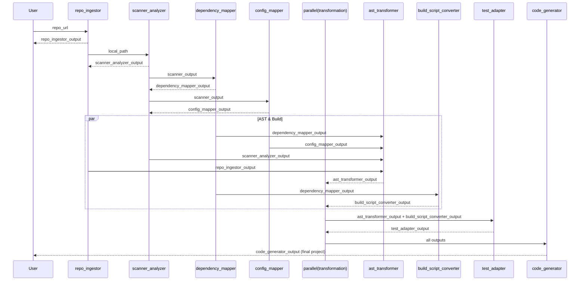
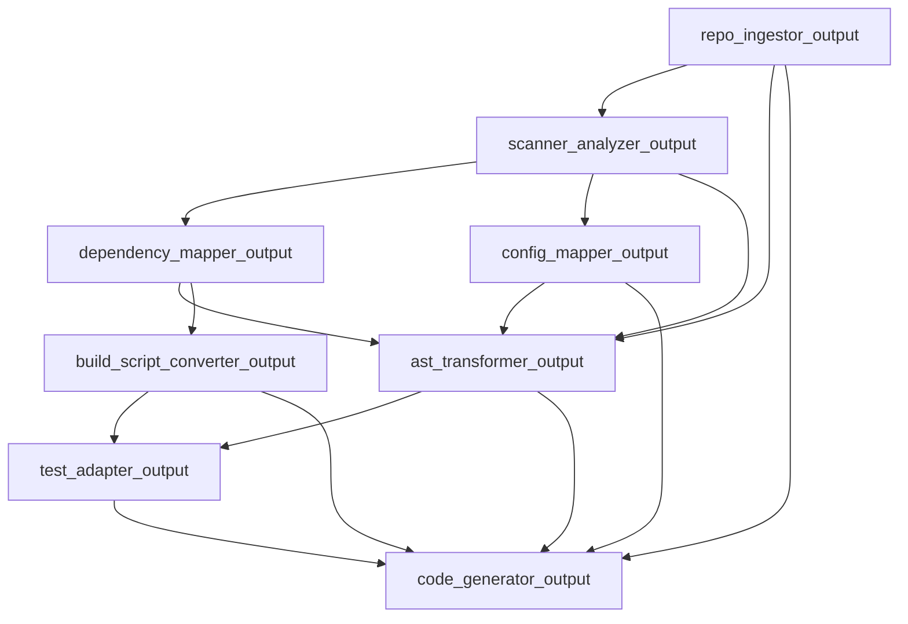

# Migration Pipeline Agent Documentation

## Overview

The `root_migrator` orchestrates an end-to-end Spring Boot → Quarkus migration using a staged pipeline with one parallel phase. Agents produce structured JSON outputs consumed by downstream agents. All agents must return pure JSON (no explanatory text) per their instruction files.

Pipeline order:

1. repo_ingestor_agent
2. scanner_analyzer_agent
3. dependency_mapper_agent
4. config_mapper_agent
5. transformation_parallel_agent (Parallel: ast_transformer_agent + build_script_converter_agent)
6. test_adapter_agent
7. code_generator_agent

Optional (future additions):

- artifact_synchronizer_agent (mirrors transformed sources to persistent output if patches sparse)
- build_normalizer_agent (cleans residual Spring Boot XML artifacts)

---

## Data Contract Summary

| Agent                        | Input Keys                                                                                                                                           | Output Key                    | Critical Fields Produced                                                                                  |
| ---------------------------- | ---------------------------------------------------------------------------------------------------------------------------------------------------- | ----------------------------- | --------------------------------------------------------------------------------------------------------- |
| repo_ingestor_agent          | repo_url, branch?                                                                                                                                    | repo_ingestor_output          | local_path, commit, build_tool, modules[], languages[], file_count                                        |
| scanner_analyzer_agent       | repo_ingestor_output.local_path                                                                                                                      | scanner_analyzer_output       | dependencies{}, annotations{}, configurations{}, complexity_score, migration_risk                         |
| dependency_mapper_agent      | scanner_analyzer_output                                                                                                                              | dependency_mapper_output      | dependency_actions[], manual_migration_items[], incompatible_dependencies[], migration_summary{}          |
| config_mapper_agent          | scanner_analyzer_output                                                                                                                              | config_mapper_output          | config_patches[], environment_variables[], secrets_identified[], migration_summary{}                      |
| ast_transformer_agent        | repo_ingestor_output, scanner_analyzer_output, dependency_mapper_output, config_mapper_output?                                                       | ast_transformer_output        | code_patches[], source_analysis{target_quarkus_path}, transformation_results{}, manual_review_items[]     |
| build_script_converter_agent | dependency_mapper_output (+ optional scanner/config)                                                                                                 | build_script_converter_output | build_patches[], quarkus_extensions[], build_profiles[], native_config{}                                  |
| test_adapter_agent           | repo_ingestor_output, scanner_analyzer_output, dependency_mapper_output, config_mapper_output, ast_transformer_output, build_script_converter_output | test_adapter_output           | test_conversion_results{}, test_execution_results{}, test_failure_analysis{}, automated_fix_suggestions[] |
| code_generator_agent         | ast_transformer_output, build_script_converter_output, test_adapter_output?, config_mapper_output?, repo_ingestor_output                             | code_generator_output         | project_path, files_created[], validation_results{}, next_steps[]                                         |

---

## JSON Schema Sketches (Simplified)

```
RepoSnapshot {
  repo_id: string, snapshot_id: string, repo_url: string,
  local_path: string, commit: string, branch: string,
  build_tool: string, project_type: string,
  modules: string[], languages: string[], file_count: int,
  success: bool, notes: string
}

FeatureMap {
  analysis_id: string, repository_path: string,
  dependencies: object, annotations: object, configurations: object,
  complexity_score: number, migration_risk: string, recommendations: string[], success: bool
}

DependencyPlan {
  success: bool, dependency_actions: Action[], manual_migration_items: object[],
  incompatible_dependencies: object[], migration_summary: object, general_recommendations: string[]
}

ConfigPatchSet {
  success: bool, config_patches: Patch[], environment_variables: string[],
  secrets_identified: string[], migration_summary: object, migration_notes: string[]
}

TransformReport {
  success: bool, source_analysis:{ target_quarkus_path: string }, code_patches: CodePatch[],
  transformation_results: object, manual_review_items: string[]
}

BuildPlan {
  success: bool, build_patches: BuildPatch[], quarkus_extensions: Ext[], build_profiles: Profile[],
  native_config: object, conversion_summary: object
}

TestAdaptationReport {
  success: bool, test_conversion_results: object, test_execution_results: object,
  test_failure_analysis: object, automated_fix_suggestions: FixSuggestion[]
}

CodeGenerationResults {
  success: bool, project_path: string, files_created: string[], validation_results: object, next_steps: string[]
}
```

---

## End-to-End Sequence (Mermaid)



---

## Parallel Phase Rationale

`ast_transformer_agent` and `build_script_converter_agent` share upstream dependencies but not each other’s outputs; parallel execution reduces latency. `test_adapter_agent` requires both AST-transformed code and converted build scripts, so it must follow the parallel phase sequentially.

---

## Input Validation Strategy

Each agent should perform guards:

- Check required upstream keys present.
- Validate structural fields (e.g., `local_path` exists on disk, `code_patches` array length).
- Emit error JSON with `success:false` and diagnostic `error` field if validation fails.

---

## Common Context Keys

```
repo_ingestor_output
scanner_analyzer_output
dependency_mapper_output
config_mapper_output
ast_transformer_output
build_script_converter_output
test_adapter_output
code_generator_output
```

---

## Error Handling Pattern

Failure JSON example:

```
{ "success": false, "error": "Missing scanner_analyzer_output", "stage": "dependency_mapper" }
```

Downstream agents must short-circuit if any prerequisite `success:false` appears.

---

## Extension Opportunities

1. artifact_synchronizer_agent (between parallel phase and test_adapter) to copy entire transformed source tree when patch granularity insufficient.
2. build_normalizer_agent to sanitize residual Spring Boot XML (parent POM removal, namespace cleanup).
3. metrics_agent to aggregate timing, counts, risk scores; output `metrics_report` for observability.

---

## Code Generator Consolidation Logic (High-Level)

1. Derive `base_path` from `create_project_structure` tool.
2. Copy transformed sources (if not already patched individually).
3. Apply `build_patches` to write build file.
4. Write Java tests from `test_adapter_output.test_conversion_results`.
5. Write config from `config_patches`.
6. Write documentation (README, MIGRATION_REPORT).
7. Docker + validation tools.

---

## Sequence (Activity View)



---

## Quality Gates

- Minimum features scanned before transformation (annotations or dependencies > 0).
- Build patch must remove Spring Boot parent & starters before acceptance.
- Transformed code must replace Spring annotations with Quarkus/CDI/JAX-RS equivalents in > X% of controller files.
- Test adaptation success rate threshold; if below, flag manual review.

---

## Next Steps / Recommendations

- Implement artifact_synchronizer_agent if code files still sparse after AST transformation.
- Add build_normalizer_agent for post-generation pom.xml cleanup.
- Introduce metrics_agent to surface pipeline KPIs.
- Enforce schema validation via Pydantic models per output key.

---

## Glossary

- Patch: Before/after diff for a single file transformation.
- Risk Score: Heuristic measure of migration complexity.
- Extension: Quarkus dependency providing runtime capability.

---

Document version: 1.0
Generated: Automated agent documentation builder.
